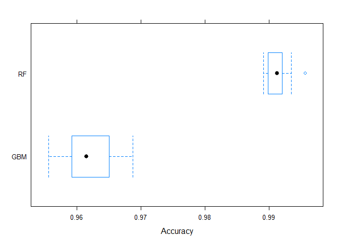

# Practical Machine Learning - Course Project
Andre Obereigner  
Sunday, 13 September, 2015  


#Background
Using devices such as Jawbone Up, Nike FuelBand, and Fitbit it is now possible to collect a large amount of data about personal activity relatively inexpensively. These type of devices are part of the quantified self movement – a group of enthusiasts who take measurements about themselves regularly to improve their health, to find patterns in their behavior, or because they are tech geeks. One thing that people regularly do is quantify how much of a particular activity they do, but they rarely quantify how well they do it. In this project, your goal will be to use data from accelerometers on the belt, forearm, arm, and dumbell of 6 participants. They were asked to perform barbell lifts correctly and incorrectly in 5 different ways. More information is available from the website here: http://groupware.les.inf.puc-rio.br/har (see the section on the Weight Lifting Exercise Dataset).

#Data Loading and Reading
First of all, let's load the data. 


```r
trainUrl <-"https://d396qusza40orc.cloudfront.net/predmachlearn/pml-trainRaw.csv"
testUrl <- "https://d396qusza40orc.cloudfront.net/predmachlearn/pml-testing.csv"
trainFile <- "./pml-training.csv"
testFile  <- "./pml-testing.csv"

if (!file.exists(trainFile)) {
  download.file(trainUrl, destfile=trainFile, method="curl")
}

if (!file.exists(testFile)) {
  download.file(testUrl, destfile=testFile, method="curl")
}
```

Next, let's read the data.


```r
trainRaw <- read.csv(trainFile)
testRaw <- read.csv(testFile)

dim(trainRaw)
```

```
## [1] 19622   160
```

```r
dim(testRaw)
```

```
## [1]  20 160
```

```r
class(trainRaw$classe)
```

```
## [1] "factor"
```

```r
table(trainRaw$classe)
```

```
## 
##    A    B    C    D    E 
## 5580 3797 3422 3216 3607
```

Both data sets contain 160 features whereas the train set includes 19622 observations and the test set contains 20 observations.


#Data Cleaning
out of curiosity, let's have a look at how many complete observations there are. Not surprisingly, the large majority of observations has missing values.


```r
sum(complete.cases(trainRaw))
```

```
## [1] 406
```

```r
sum(complete.cases(testRaw))
```

```
## [1] 0
```

Next, let's remove near zero variance features.


```r
nsv <- nearZeroVar(trainRaw, saveMetrics = TRUE)
trainRaw <- trainRaw[, !nsv$nzv]
```

Similarly, let's identify columns which have lots of missing values. It turns out that there are 41 features with 19216 missing values, representing 0.9793.


```r
table(colSums(is.na(trainRaw)))
```

```
## 
##     0 19216 
##    59    41
```

```r
colNA09 <- colSums(is.na(trainRaw)) > 0.9*nrow(trainRaw)
trainRaw <- trainRaw[, !colNA09]
```

In the last step, let's remove the features which are irrelevant for the analysis at hand.


```r
colnames(trainRaw[grepl("^X|window|timestamp", names(trainRaw))])
```

```
## [1] "X"                    "raw_timestamp_part_1" "raw_timestamp_part_2"
## [4] "cvtd_timestamp"       "num_window"
```

```r
colIRR <- grepl("^X|window|timestamp", names(trainRaw))
trainRaw <- trainRaw[, !colIRR]
```

#Slicing the Data
In the next step, let's split the date into a training and validation data set.


```r
set.seed(101)

inTrain <- createDataPartition(trainRaw$classe, p=0.70, list=F)
trainingData <- trainRaw[inTrain, ]
validationData <- trainRaw[-inTrain, ]
```

#Model Building
In the following section, I outline the model building setup as well as the model results.

##Random Forest Model


```r
model01 <- train(classe ~ ., 
                 method = "rf", 
                 data = trainingData, 
                 importance = TRUE, 
                 trControl = trainControl(method = "cv", number = 10))

model01
```

```
## Random Forest 
## 
## 13737 samples
##    53 predictor
##     5 classes: 'A', 'B', 'C', 'D', 'E' 
## 
## No pre-processing
## Resampling: Cross-Validated (10 fold) 
## 
## Summary of sample sizes: 12363, 12364, 12364, 12365, 12364, 12362, ... 
## 
## Resampling results across tuning parameters:
## 
##   mtry  Accuracy  Kappa   Accuracy SD  Kappa SD
##    2    0.9900    0.9874  0.003143     0.003978
##   29    0.9913    0.9890  0.001983     0.002508
##   57    0.9818    0.9770  0.004320     0.005464
## 
## Accuracy was used to select the optimal model using  the largest value.
## The final value used for the model was mtry = 29.
```

```r
#plot(model01, ylim = c(0.9, 1))

model01.predict <- predict(model01, validationData)
confusionMatrix(model01.predict, validationData$classe)
```

```
## Confusion Matrix and Statistics
## 
##           Reference
## Prediction    A    B    C    D    E
##          A 1670    7    0    0    0
##          B    2 1127    1    0    0
##          C    1    5 1023    6    2
##          D    0    0    2  955    5
##          E    1    0    0    3 1075
## 
## Overall Statistics
##                                         
##                Accuracy : 0.994         
##                  95% CI : (0.992, 0.996)
##     No Information Rate : 0.284         
##     P-Value [Acc > NIR] : <2e-16        
##                                         
##                   Kappa : 0.992         
##  Mcnemar's Test P-Value : NA            
## 
## Statistics by Class:
## 
##                      Class: A Class: B Class: C Class: D Class: E
## Sensitivity             0.998    0.989    0.997    0.991    0.994
## Specificity             0.998    0.999    0.997    0.999    0.999
## Pos Pred Value          0.996    0.997    0.986    0.993    0.996
## Neg Pred Value          0.999    0.997    0.999    0.998    0.999
## Prevalence              0.284    0.194    0.174    0.164    0.184
## Detection Rate          0.284    0.192    0.174    0.162    0.183
## Detection Prevalence    0.285    0.192    0.176    0.163    0.183
## Balanced Accuracy       0.998    0.994    0.997    0.995    0.996
```

When training a Random Forst model on the training data set and applying it to the validation data set, we get an **overall agreement (accuracy) of 0.9941**. 

##Generalized Boosted Regression Model


```r
model02 <- train(classe ~ ., 
                 method = "gbm", 
                 data = trainingData, 
                 verbose = FALSE, 
                 trControl = trainControl(method = "cv", number = 10))
```

```
## Loading required package: gbm
## Loading required package: survival
## Loading required package: splines
## 
## Attaching package: 'survival'
## 
## The following object is masked from 'package:caret':
## 
##     cluster
## 
## Loading required package: parallel
## Loaded gbm 2.1
## Loading required package: plyr
```

```r
model02
```

```
## Stochastic Gradient Boosting 
## 
## 13737 samples
##    53 predictor
##     5 classes: 'A', 'B', 'C', 'D', 'E' 
## 
## No pre-processing
## Resampling: Cross-Validated (10 fold) 
## 
## Summary of sample sizes: 12364, 12361, 12363, 12365, 12363, 12363, ... 
## 
## Resampling results across tuning parameters:
## 
##   interaction.depth  n.trees  Accuracy  Kappa   Accuracy SD  Kappa SD
##   1                   50      0.7542    0.6883  0.010578     0.013355
##   1                  100      0.8206    0.7729  0.008035     0.010182
##   1                  150      0.8505    0.8108  0.007236     0.009173
##   2                   50      0.8536    0.8145  0.006450     0.008216
##   2                  100      0.9075    0.8829  0.008080     0.010209
##   2                  150      0.9322    0.9141  0.004480     0.005661
##   3                   50      0.8958    0.8681  0.007525     0.009527
##   3                  100      0.9415    0.9259  0.005521     0.006994
##   3                  150      0.9619    0.9518  0.004347     0.005493
## 
## Tuning parameter 'shrinkage' was held constant at a value of 0.1
## Accuracy was used to select the optimal model using  the largest value.
## The final values used for the model were n.trees = 150,
##  interaction.depth = 3 and shrinkage = 0.1.
```

```r
#plot(model02, ylim = c(0.9, 1))

model02.predict <- predict(model02, validationData)
confusionMatrix(model02.predict, validationData$classe)
```

```
## Confusion Matrix and Statistics
## 
##           Reference
## Prediction    A    B    C    D    E
##          A 1645   45    0    0    1
##          B   20 1056   34    3   17
##          C    6   33  981   28    6
##          D    1    2   10  926   12
##          E    2    3    1    7 1046
## 
## Overall Statistics
##                                         
##                Accuracy : 0.961         
##                  95% CI : (0.955, 0.966)
##     No Information Rate : 0.284         
##     P-Value [Acc > NIR] : < 2e-16       
##                                         
##                   Kappa : 0.95          
##  Mcnemar's Test P-Value : 0.0000145     
## 
## Statistics by Class:
## 
##                      Class: A Class: B Class: C Class: D Class: E
## Sensitivity             0.983    0.927    0.956    0.961    0.967
## Specificity             0.989    0.984    0.985    0.995    0.997
## Pos Pred Value          0.973    0.935    0.931    0.974    0.988
## Neg Pred Value          0.993    0.983    0.991    0.992    0.993
## Prevalence              0.284    0.194    0.174    0.164    0.184
## Detection Rate          0.280    0.179    0.167    0.157    0.178
## Detection Prevalence    0.287    0.192    0.179    0.162    0.180
## Balanced Accuracy       0.986    0.956    0.971    0.978    0.982
```

When training a Generalized Boosted Regression model on the training data set and applying it to the validation data set, we get an **overall agreement (accuracy) of 0.9607**. 

Judging from the performance of the models on the validation data set, the Random Forest performs exhibits the best performance.

##Model Comparison and Conclusion

```r
# Doing Between-Model Comparisons
#########################################
crossValidation.values <- resamples(list(RF = model01,
                                         GBM = model02))
summary(crossValidation.values)
```

```
## 
## Call:
## summary.resamples(object = crossValidation.values)
## 
## Models: RF, GBM 
## Number of resamples: 10 
## 
## Accuracy 
##      Min. 1st Qu. Median  Mean 3rd Qu.  Max. NA's
## RF  0.989   0.990  0.991 0.991   0.992 0.996    0
## GBM 0.956   0.959  0.961 0.962   0.965 0.969    0
## 
## Kappa 
##      Min. 1st Qu. Median  Mean 3rd Qu.  Max. NA's
## RF  0.986   0.987  0.989 0.989   0.990 0.994    0
## GBM 0.944   0.948  0.951 0.952   0.956 0.960    0
```

```r
bwplot(crossValidation.values, metric = "Accuracy")
```

 

When taking a close look at the cross-validation of the two models with 10 resamples, we come to the same conclusion. The **Random Forest model performs best with a mean and median accuracy of 0.992 and 0.991, respectively**, compared to 0.96 for both statistics of the Generalized Boosted Regression model.

In addition, the above graph confirms the conclusion visually and also highlights that the **Random Forst model has a narrower range of accuracy** than the Generalized Boosted Regression model on the 10 resamples.


```r
#True accuracy of the winning model01.
model01.accuracy <- postResample(model01.predict, validationData$classe)[1]
model01.ooSampleError <- 1 - model01.accuracy
model01.ooSampleError
```

```
## Accuracy 
## 0.005947
```

With an accuracy of **model01** on the validation data set of 0.99, **the out of sample error is 0.0059 or 0.59%**.


#Prediction of Test Data
In the last section, I will generate the predictions for the test data set, provide a brief summary of predictions and prepare the files for the submission of the predictions.


```r
model01.testpredict <- predict(model01, testRaw)

answers <- as.character(model01.testpredict)
table(answers)
```

```
## answers
## A B C D E 
## 7 8 1 1 3
```

```r
#Code for the creation of submission files as provided by Coursera.
pml_write_files = function(x){
  n = length(x)
  for(i in 1:n){
    filename = paste0("problem_id_",i,".txt")
    write.table(x[i],file=filename,quote=FALSE,row.names=FALSE,col.names=FALSE)
  }
}
pml_write_files(answers)
```


